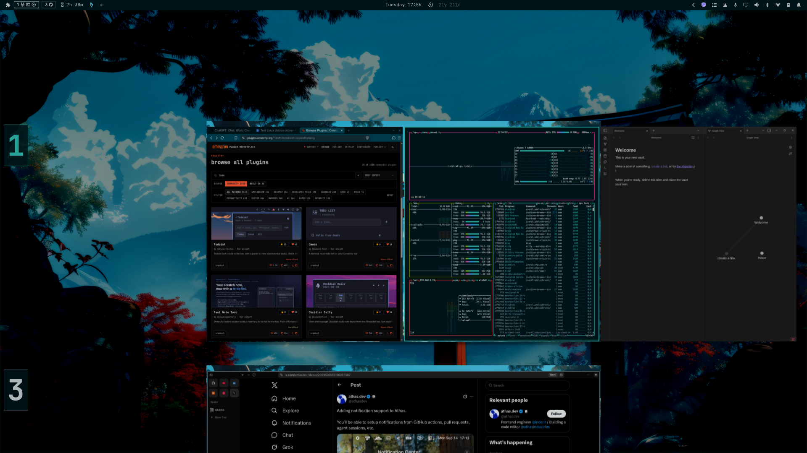
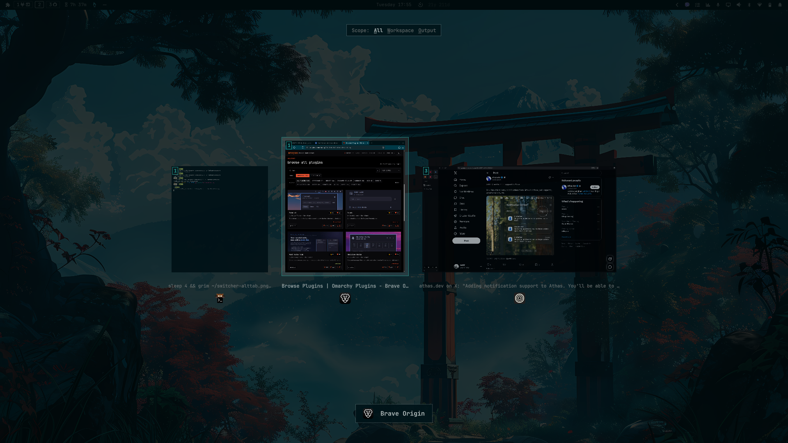
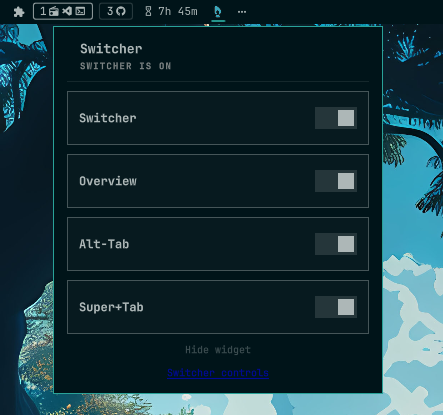

# Switcher

A polished fork of [Omari](https://github.com/chicreativetech/omari) - Niri-inspired window management for Omarchy. Same scrolling layout, gestures, overview, and switcher, refined into a cleaner popup with individually toggleable settings, the official Niri icon, and a hideable bar widget.

## What's enhanced

- Redesigned Alt-Tab switcher with smoother behavior and bug fixes (elected scope stays active
  while switching between windows.)
- Shift-Tab support in the overview, with smooth animated transitions for
  backward window switching and and and updated the bar widget with the official Niri icon for a cleaner Niri-inspired
  look.
- Hide/show toggle for removing the Switcher widget from the bar without
  disabling the plugin.
- Redesigned overview with a backdrop, improved visual hierarchy, and refined
  aesthetics.

## Screenshots

| Feature | Preview |
| --- | --- |
| Workspace Overview (Super + Tab) |  |
| Windows overview (Alt + Tab) |  |
| Switcher controls |  |


## Requirements

- Omarchy with the Quattro shell and `omarchy plugin` commands.
- Hyprland with Lua configuration, the scrolling layout, gesture callbacks,
  `hl.timer`, and `hl.is_key_down` support.
- Omarchy's default Hyprland toggle loader (`default.hypr.toggles`).
- Quickshell with QtQuick, QtQuick.Controls, QtQuick.Effects, Quickshell.Io,
  Quickshell.Wayland, and Quickshell.Hyprland, plus Omarchy's `qs.Commons` and
  `qs.Ui` modules.
- Bash, coreutils, and `hyprctl`. A multitouch trackpad is needed for
  gestures; keyboard controls also work.

Older Hyprland installations using only `hyprland.conf` are not supported.
There is no Niri dependency, remote build, package installer, extra service,
network request, or privileged command. The plugin runs inside the existing
Omarchy shell process with your user permissions.

## Install

```sh
omarchy plugin add https://github.com/paudelsamir/switcher.git --enable
omarchy bar move paudelsamir.switcher --section right
```

Click the bar icon and turn on **Switcher**. The three settings - Overview,
Alt-Tab, and Workspace - appear below it, each independently toggleable.
Right-clicking the icon toggles the mode directly.

Enabling mode copies the bundled `hypr/switcher-*.lua` files into
`${XDG_STATE_HOME:-$HOME/.local/state}/omarchy/toggles/hypr/` and reloads
Hyprland. These files persist across login. Existing configuration files are
not edited. Review `hypr/` for the full configuration; custom bindings may
conflict.

## Controls

`SUPER` is the Windows/Command key. Enable the corresponding Switcher
feature in the bar popup to use its shortcuts.

### Keyboard shortcuts

**Desktop navigation**

| Shortcut | Action |
| --- | --- |
| SUPER+Left / Right | Focus the previous / next window column |
| SUPER+Up / Down | Focus the window above / below within a column |
| SUPER+PageDown | Go to the next workspace |
| SUPER+PageUp | Go to the previous workspace |
| SUPER+ALT+O | Open the overview |
| SUPER+TAB | Switch workspaces through the overview |
| SUPER+SHIFT+TAB | Switch workspaces backwards through the overview |
| ALT+TAB | Open the window switcher and select the next window |
| ALT+SHIFT+TAB | Open the window switcher and select the previous window |

**While the overview is open**

| Shortcut | Action |
| --- | --- |
| Up / Down | Select the previous / next workspace row |
| Left / Right | Select the previous / next window in the row |
| Enter or Space | Activate the selected window or empty workspace |
| SUPER+ALT+O | Activate the selection and close the overview |
| Escape | Cancel and return to the original desktop |

**While using SUPER+TAB**

Hold `SUPER`, press `TAB`, and keep holding `SUPER` while navigating. The arrow
keys temporarily belong to the overview instead of the normal desktop
navigation bindings. Release `SUPER` after activating or cancelling the
selection.

| Shortcut | Action |
| --- | --- |
| SUPER+TAB | Open the overview at the next workspace |
| SUPER+SHIFT+TAB | Open the overview at the previous workspace |
| SUPER+Up / Down | Select the previous / next workspace row |
| SUPER+Left / Right | Select the previous / next window in the row |
| SUPER+Enter or SUPER+Space | Activate the selection |
| Escape | Cancel and return to the original desktop |

**While the window switcher is open**

Keep `ALT` held while browsing or changing the scope.

| Shortcut | Action |
| --- | --- |
| Tab / SHIFT+Tab | Select the next / previous window |
| Left / Right | Select the previous / next window |
| A | Show windows from all workspaces |
| W | Show windows from the current workspace |
| O | Show windows from the current display |
| Release ALT | Activate the selected window |
| Enter or Space | Activate the selected window immediately |
| Escape | Cancel without switching windows |

### Gestures and mouse

| Control | Action |
| --- | --- |
| Three-finger horizontal swipe | Scroll along window columns |
| Three-finger vertical swipe | Change workspace |
| Four-finger swipe up | Open the overview |
| Four-finger swipe down in the overview | Activate the selection and close the overview |
| Two-finger scrolling in the overview | Browse workspaces vertically or windows horizontally |
| Click a window preview | Activate that window |
| Click the empty workspace in the overview | Switch to that workspace |

## Disable and remove

Turn off **Switcher** before disabling or removing the plugin. For explicit
cleanup, including when the shell is not running:

```sh
bash "$HOME/.config/omarchy/plugins/paudelsamir.switcher/bin/switcher-toggle" all off
omarchy plugin remove paudelsamir.switcher
```

Cleanup deletes only the generated toggle files and reloads Hyprland,
restoring the underlying configuration. If Hyprland is stopped, the next
session loads without those toggles.

## Development

Keep the permanent plugin ID `paudelsamir.switcher`. The root manifest declares
`Panel.qml` as the bar widget and `SwitcherOverview.qml` as the overlay; the
latter loads `SwitcherAltTab.qml` internally.

```sh
omarchy plugin validate .
qmllint -I "$OMARCHY_PATH/shell" ./*.qml
bash -n bin/switcher-toggle
for source in hypr/*.lua; do luac -p "$source"; done
```

On Arch, `qmllint` may be at `/usr/lib/qt6/bin/qmllint`. Inspect runtime
errors with `qs log -p "$OMARCHY_PATH/shell" --tail 100`.

Before release, test a fresh install, all toggles and controls, light and
dark themes, multiple displays, shell reload, and removal. Confirm that
removal leaves no `switcher-*.lua` toggle files.

## License

MIT - see [LICENSE](LICENSE).

>[!NOTE]
>This project adds the refinements listed above while preserving compatibility
>with the original Lua configuration and Hyprland integration.
